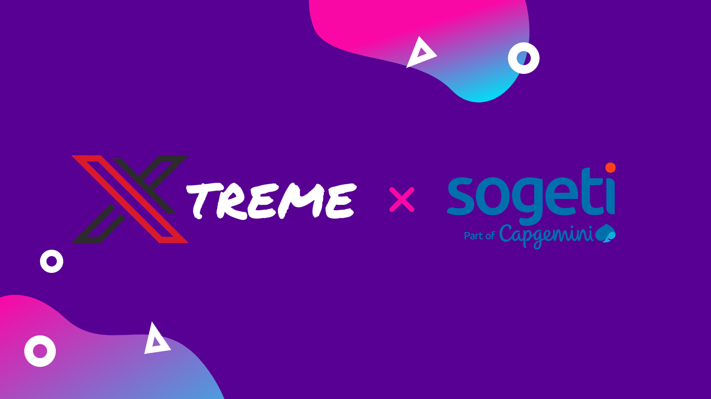

# Xtreme 🚀

_Xtreme es un equipo formado por dos personas para la realizacion de la #1 hackatlon de la empresa Sogeti en colaboracion con S2V Esports_
(https://www.sogeti.es/explora/eventos/hackathon-S2V/)

## ¿Sobre que trata la hackathon?

_Se pide diseñar una aplicacion para representar datos de la API de un videojuego (GTAV roleplay). El elegido será integrado en el servidor, y hay premios por participar y por ganar. Hemos tenido desde el 26 de Noviembre hasta el 10 de Diciembre para poder trabajar en el proyecto (2~ semanas)_

## Construido con 🛠️

* [Angular](https://angular.io/) - Un framework de front-end muy popular a dia de hoy.

### ¿Por que Angular?
_Angular es uno de los frameworks de front-end mas popurales, el cuál usa modelo MVC y a pesar de su complejidad a la hora de familiarizarse con el framework, es una de las mejores opciones actualmente._

## Autores ✒️

* **Gerard Alexander Nina** - [GerardNP](https://github.com/GerardNP)
* **Sergio Arribas** - [Sergio-ASdev](https://github.com/Sergio-ASdev)

